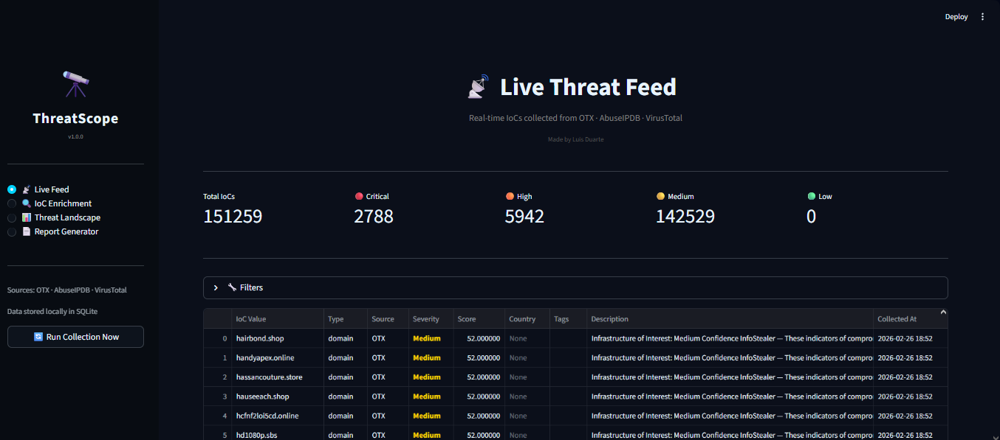
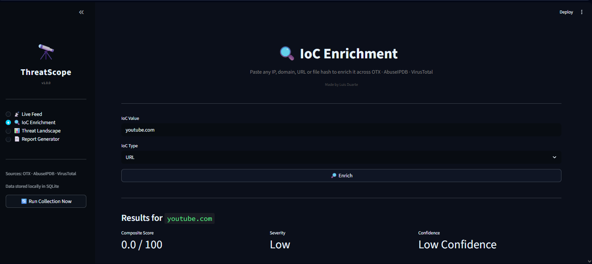
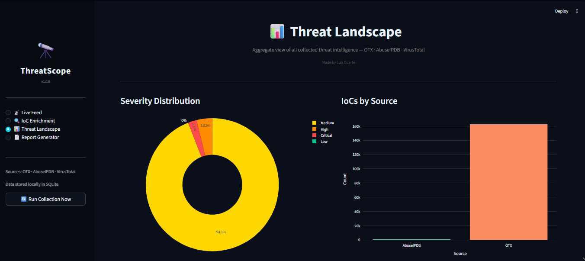
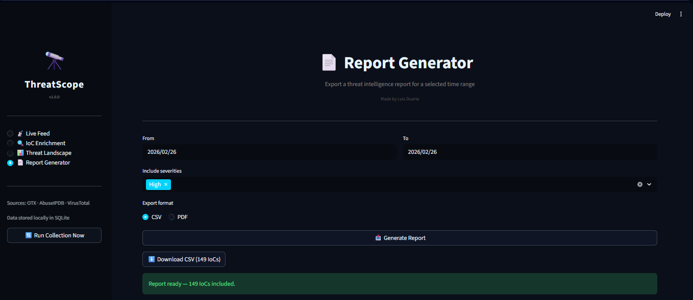

# 🔭 ThreatScope

A threat intelligence platform that aggregates, enriches, and classifies Indicators of Compromise (IoCs) from multiple public feeds in real time — built for analysts who want signal, not noise.



---

## What it does

ThreatScope pulls IoCs from three sources — AlienVault OTX, AbuseIPDB, and VirusTotal — normalizes them, scores them using a weighted composite model, and stores everything locally in SQLite. The dashboard lets you filter, investigate, and export threat data without touching an API manually.

It started as a personal project to scratch an itch: I wanted a single place to monitor what OTX and AbuseIPDB were flagging without jumping between tabs and copy-pasting hashes into VirusTotal.

---

## Screenshots

**Live Threat Feed** — filterable IoC table with severity color-coding and CSV export


**IoC Enrichment** — paste any IP, domain, URL, or hash and get a cross-source verdict instantly



**Threat Landscape** — aggregate view of severity distribution, source breakdown, and IoC type breakdown



**Report Generator** — export filtered threat data as CSV or PDF for a selected time range



---

## How the scoring works

Each IoC gets a composite score from 0–100 based on three weighted sources:

| Source | Weight | What it measures |
|---|---|---|
| AbuseIPDB | 40% | Community-reported abuse confidence |
| AlienVault OTX | 35% | Adversary attribution, MITRE ATT&CK coverage, malware families |
| VirusTotal | 25% | Ratio of malicious/suspicious detections across engines |

Severity is then assigned by threshold:

- **Critical** — score ≥ 80
- **High** — score 60–79
- **Medium** — score 40–59
- **Low** — score < 40

---

## Tech stack

- **Python 3.11+**
- **Streamlit** — dashboard
- **SQLite** — local storage
- **Plotly** — charts
- **fpdf2** — PDF report generation
- **AlienVault OTX API** — pulse feed
- **AbuseIPDB API** — IP blacklist + enrichment
- **VirusTotal API v3** — IoC enrichment

---

## Setup

**1. Clone the repo**

```bash
git clone https://github.com/your-username/threatscope.git
cd threatscope
```

**2. Create a virtual environment**

```bash
python -m venv venv
venv\Scripts\activate        # Windows
source venv/bin/activate     # macOS/Linux
```

**3. Install dependencies**

```bash
pip install --only-binary=:all: streamlit requests pandas plotly python-dotenv schedule fpdf2
```

**4. Configure API keys**

```bash
copy .env.example .env      # Windows
cp .env.example .env        # macOS/Linux
```

Open `.env` and fill in your keys:

```
OTX_API_KEY=your_otx_key
ABUSEIPDB_API_KEY=your_abuseipdb_key
VIRUSTOTAL_API_KEY=your_virustotal_key
```

All three APIs have free tiers. OTX is unlimited for public pulses. AbuseIPDB allows 1,000 checks/day. VirusTotal allows 500 lookups/day at 4/min.

**5. Run the first collection**

```bash
python -m collectors.run_collectors
```

**6. Launch the dashboard**

```bash
# Windows — set PYTHONPATH first
$env:PYTHONPATH = "C:\path\to\threatscope"
streamlit run dashboard/app.py
```

---

## Project structure

```
threatscope/
├── collectors/
│   ├── otx_collector.py          # AlienVault OTX pulse collection
│   ├── abuseipdb_collector.py    # AbuseIPDB blacklist + enrichment
│   ├── virustotal_collector.py   # VirusTotal IoC enrichment
│   └── run_collectors.py         # Orchestrator
├── processors/
│   ├── scorer.py                 # Composite scoring logic
│   └── normalizer.py             # IoC cleaning and normalization
├── database/
│   └── db_handler.py             # SQLite CRUD + indexed queries
├── dashboard/
│   ├── app.py                    # Streamlit entry point
│   └── pages/
│       ├── live_feed.py
│       ├── enrichment.py
│       ├── threat_landscape.py
│       └── report_generator.py
├── config.py
├── .env.example
└── requirements.txt
```

---

## API limits (free tier)

| Source | Limit |
|---|---|
| AlienVault OTX | Unlimited (public pulses) |
| AbuseIPDB | 1,000 checks/day |
| VirusTotal | 500 lookups/day, 4/min |

---

## Author

Built by **Luis Duarte**

[LinkedIn](https://www.linkedin.com/in/luis-duarte-560993291/) 
